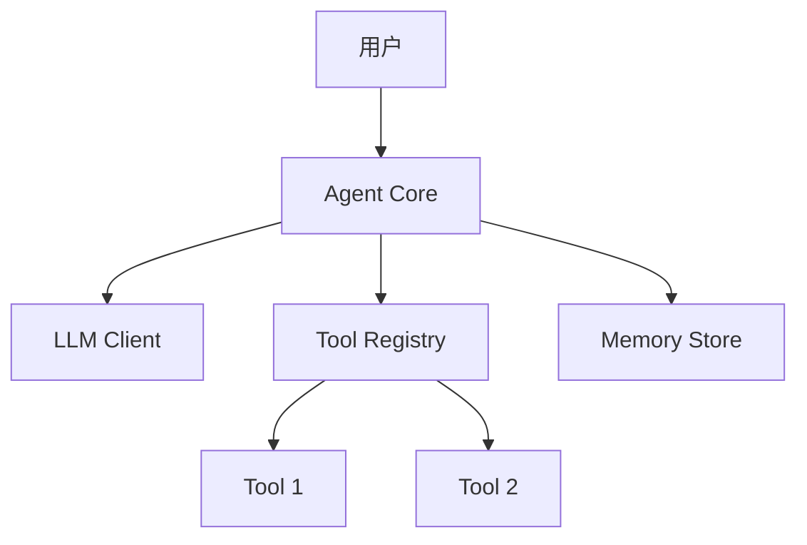
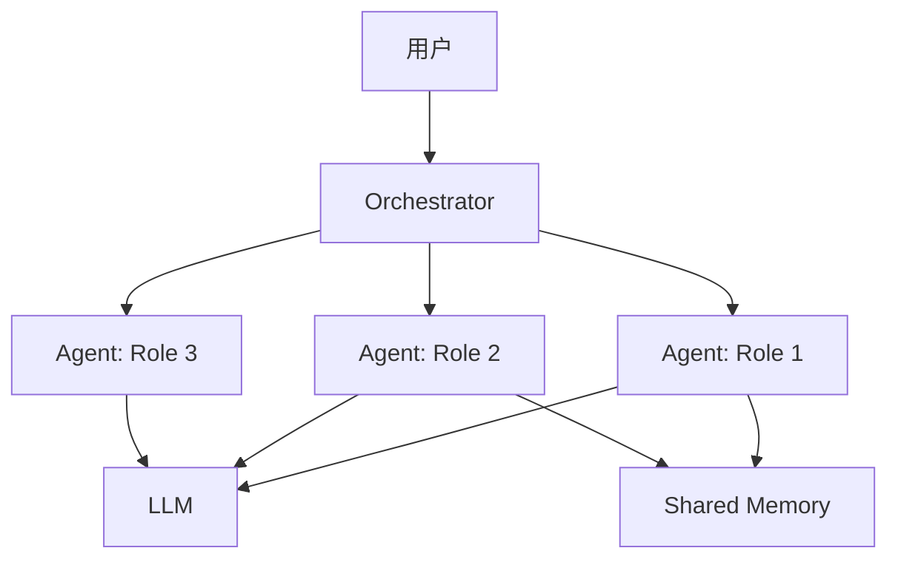
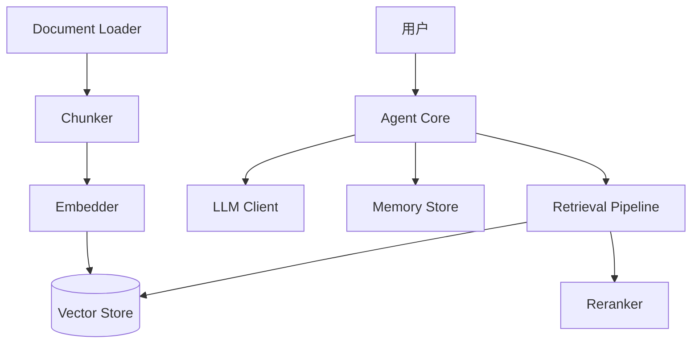

# Phase 2: 架构设计（Architecture）引导细则

## 入口条件

- Phase 1 的 `agent-spec.md` 已确认
- 已知 Agent 类型和框架选型

## 活动流程

### Step 1: 加载架构模式

读取 `agent-patterns-catalog` Skill 中对应 Agent 类型的 reference 文件：

| Agent 类型 | Reference 文件 |
|-----------|---------------|
| ReAct | `agent-patterns-catalog/references/react-agent.md` |
| Multi-Agent Conversation | `agent-patterns-catalog/references/multi-agent-conversation.md` |
| Multi-Agent Workflow | `agent-patterns-catalog/references/multi-agent-workflow.md` |
| RAG Agent | `agent-patterns-catalog/references/rag-agent.md` |
| Tool-Use Agent | `agent-patterns-catalog/references/tool-use-agent.md` |
| Autonomous Agent | `agent-patterns-catalog/references/autonomous-agent.md` |

混合类型时读多个文件，组合架构。

### Step 2: 组件拓扑设计

根据 spec 确认所需组件：

| 组件 | 何时需要 | 职责 |
|------|---------|------|
| Agent Core | 始终 | 主控循环、决策 |
| LLM Client | 始终 | 调用大模型 |
| Tool Registry | 有工具时 | 工具注册与分发 |
| Memory Store | 需要上下文时 | 对话历史 / 实体记忆 |
| Vector Store | RAG 场景 | 向量检索 |
| Document Loader | RAG 场景 | 文档解析 |
| Orchestrator | Multi-Agent | 编排与路由 |
| State Manager | Workflow | 状态机 / DAG 执行 |
| Human-in-Loop | 需要审批时 | 人工确认节点 |

### Step 3: 生成 Mermaid 架构图

**单 Agent 模板**:


**Multi-Agent 模板**:


**RAG Agent 模板**:


根据实际需求调整模板，确保图中每个节点都对应 agent-spec 中的需求。

### Step 4: 数据流描述

对每条核心路径，描述数据如何流转：

```
1. 用户输入 → Agent Core
2. Agent Core 决定调用 Tool A → 传入参数 {param}
3. Tool A 返回结果 → Agent Core
4. Agent Core 组合结果 → 调用 LLM 生成 Response
5. Response → 存入 Memory → 返回用户
```

### Step 5: 设计决策记录

每个关键设计决策需要结构化记录：

| 决策 | 选项 A | 选项 B | 选择 | 理由 |
|------|--------|--------|------|------|
| 通信模式 | 同步 | 异步消息 | 同步 | 简单场景，无需消息队列 |
| Memory 类型 | Buffer | Entity | Buffer | 对话短，无实体提取需求 |

### Step 6: Multi-Agent 角色定义（如适用）

| 角色名 | 职责 | 可用工具 | 特殊约束 |
|--------|------|----------|----------|
| Planner | 任务分解 | 无 | 只输出 JSON plan |
| Executor | 执行子任务 | 全部 | 需要用户审批危险操作 |
| Reviewer | 检查结果 | 无 | 必须给出评分 |

## agent-architecture.md 输出模板

```markdown
# Agent Architecture

## 架构模式

- 模式名称: {pattern_name}
- 基础描述: {description}

## 组件拓扑

{mermaid_diagram}

## 组件职责

| 组件 | 职责 | 技术选型 |
|------|------|----------|
| {component} | {responsibility} | {technology} |

## 核心数据流

{data_flow_description}

## Multi-Agent 角色定义

{role_table}（如适用）

## 设计决策

{decision_table}
```

## 确认点

展示 agent-architecture.md 的完整内容（包括 Mermaid 图），请用户确认或提出调整意见。如有调整，修改后再次确认。
