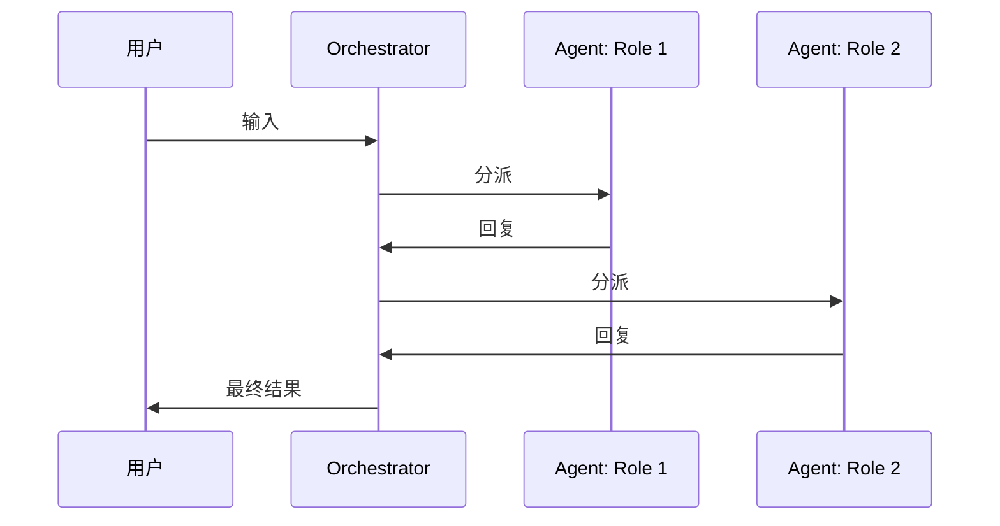
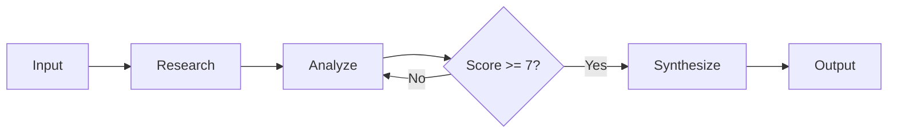

# Phase 4: Prompt 与编排设计（Prompt & Orchestration）引导细则

## 入口条件

- Phase 3 的 `agent-tools.md` 已确认
- 已知全部工具、Memory 和 RAG 配置

## System Prompt 设计

### Step 1: 角色与人格

根据 agent-spec 中的描述构建 System Prompt 的角色部分：

```
你是 {agent_name}，一个 {agent_description}。

## 你的核心职责
{responsibilities_from_spec}

## 你的行为准则
- {rule_1}
- {rule_2}
```

**引导问题**:
- Agent 应该用什么语气？（专业 / 友好 / 简洁 / 详尽）
- Agent 是否需要拒绝某些类型的请求？
- Agent 是否需要在特定条件下升级给人类？

### Step 2: 工具使用指令

自动根据 agent-tools.md 生成工具使用部分：

```
## 可用工具

你可以使用以下工具来完成任务：

### {tool_name}
- 描述: {tool_description}
- 何时使用: {when_to_use}
- 输入: {input_schema}
- 注意: {caveats}
```

**每个工具需要确认**:
- "何时使用"的触发条件
- 工具调用频率限制（如果有）
- 工具之间的优先级

### Step 3: 输出格式

```
## 输出要求

- 回复语言: {language}
- 格式: {format}（纯文本 / Markdown / JSON / 结构化）
- 引用来源: {citation_style}（如 RAG Agent）
- 不确定时: {uncertainty_handling}
```

### Step 4: Few-shot Examples（可选）

```
## 示例

### 示例 1: {scenario}
用户: {user_input}
思考: {thinking_process}
行动: {tool_calls}
回复: {response}
```

是否需要 few-shot examples 取决于：
- 输出格式是否非标准
- 工具调用逻辑是否复杂
- 用户是否提供了样例对话

## 编排逻辑设计

### 单 Agent 编排

```yaml
orchestration:
  type: single_agent
  execution:
    max_iterations: 10
    timeout: 120s
    termination:
      - condition: "agent 返回 FINAL_ANSWER"
      - condition: "达到 max_iterations"
        action: "返回当前最佳结果 + 说明未完成"
  error_handling:
    tool_error: "报告错误，尝试替代方案"
    llm_error: "重试 2 次，然后返回友好错误信息"
    timeout: "返回已完成的部分结果"
```

### Multi-Agent Conversation 编排

```yaml
orchestration:
  type: multi_agent_conversation
  agents:
    - role: {role_1}
      prompt: "{system_prompt_1}"
      tools: [{tool_list}]
    - role: {role_2}
      prompt: "{system_prompt_2}"
      tools: [{tool_list}]
  routing:
    strategy: llm_based      # round_robin / llm_based / rule_based / function_based
    router_prompt: "根据当前对话状态，选择下一个应该发言的角色..."
    max_rounds: 20
  termination:
    - condition: "所有角色达成一致"
    - condition: "达到 max_rounds"
  shared_state:
    type: conversation_history
    visible_to: all
```

### Multi-Agent Workflow 编排

```yaml
orchestration:
  type: multi_agent_workflow
  stages:
    - name: "research"
      agent: researcher
      input: "{user_query}"
      output: "research_results"
    - name: "analyze"
      agent: analyst
      input: "{research_results}"
      output: "analysis"
      parallel: false
    - name: "review"
      agent: reviewer
      input: "{analysis}"
      output: "review_result"
      gate:                    # 可选：门控
        condition: "review_result.score >= 7"
        on_fail: "回到 analyze 阶段"
    - name: "synthesize"
      agent: synthesizer
      input: ["{research_results}", "{analysis}", "{review_result}"]
      output: "final_result"
  error_handling:
    stage_timeout: 60s
    stage_retry: 1
    pipeline_timeout: 300s
```

### Autonomous Agent 编排

```yaml
orchestration:
  type: autonomous
  plan_phase:
    prompt: "将以下任务分解为子任务列表..."
    output_format: json_plan
    max_subtasks: 10
  execute_phase:
    per_subtask_timeout: 60s
    parallel_execution: false    # 是否并行执行子任务
  reflect_phase:
    prompt: "评估以下执行结果是否满足目标..."
    replan_threshold: "score < 0.7"
    max_replans: 3
  human_in_loop:
    enabled: false
    trigger: "风险操作或 confidence < 0.5 时"
```

## Mermaid 流程图

为编排逻辑生成 Mermaid 流程图：

**Conversation 模式**:


**Workflow 模式**:


## 输出文件

### agent-prompts.md

```markdown
# Agent Prompts

## System Prompt

\`\`\`
{complete_system_prompt}
\`\`\`

## Few-shot Examples

{examples_if_any}

## Multi-Agent Prompts（如适用）

### Role: {role_name}
\`\`\`
{role_system_prompt}
\`\`\`
```

### agent-orchestration.md

```markdown
# Agent Orchestration

## 编排模式

- 类型: {orchestration_type}
- 最大循环次数: {max_iterations}
- 超时时间: {timeout}

## 编排逻辑

{orchestration_config_yaml}

## 流程图

{mermaid_diagram}

## 路由策略（如适用）

{routing_config}

## 错误处理

| 错误类型 | 处理策略 |
|---------|---------|
| 工具调用失败 | {strategy} |
| LLM 调用失败 | {strategy} |
| 超时 | {strategy} |

## 终止条件

{termination_conditions}
```

## 确认点

分别展示 agent-prompts.md 和 agent-orchestration.md，逐个确认。Prompt 文本需要特别仔细的审批。
