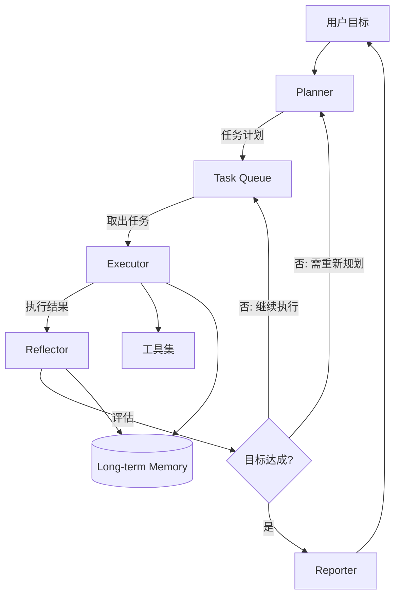

# Autonomous Agent 模式

## 核心思想

**Plan → Execute → Reflect** — Agent 自主将复杂目标分解为子任务计划，
逐步执行，在每步执行后评估进展，必要时重新规划。适合开放式、长周期、目标驱动的任务。

## 参考架构



## 核心循环

```
goal = user_input
plan = planner.decompose(goal)
memory = LongTermMemory()

while not goal_achieved(plan, memory):
    current_task = plan.next_task()
    
    # Execute
    result = executor.run(current_task, tools, memory)
    memory.store(current_task, result)
    
    # Reflect
    reflection = reflector.evaluate(
        goal=goal,
        plan=plan,
        completed=memory.get_completed(),
        current_result=result
    )
    
    if reflection.needs_replan:
        plan = planner.replan(goal, memory, reflection.reason)
    elif reflection.task_failed:
        plan.retry_or_skip(current_task, reflection.suggestion)

report = reporter.summarize(goal, memory)
return report
```

## 组件职责

| 组件 | 职责 | 关键配置 |
|------|------|---------|
| Planner | 目标分解、任务排序、重新规划 | `decomposition_strategy`, `max_tasks` |
| Executor | 执行单个任务，调用工具 | `tools`, `timeout`, `max_retries` |
| Reflector | 评估进展、判断是否需要调整 | `eval_criteria`, `replan_threshold` |
| Memory | 存储执行历史和中间产物 | `backend`, `retrieval_strategy` |
| Reporter | 汇总最终结果 | `format`, `include_trace` |

## 规划策略

| 策略 | 描述 | 适用场景 |
|------|------|---------|
| Top-Down | 先全局规划再执行 | 目标清晰、任务可预见 |
| Incremental | 每次只规划下一步 | 探索性任务、信息不确定 |
| Hierarchical | 多层级分解（目标→子目标→任务）| 复杂长期项目 |
| Adaptive | 初始规划 + 动态调整 | 推荐的默认策略 |

## 反思维度

```yaml
reflection:
  dimensions:
    - name: "progress"
      question: "完成了多少？距离目标还有多远？"
    - name: "quality"
      question: "当前结果的质量是否达标？"
    - name: "efficiency"
      question: "是否有更高效的方法？"
    - name: "feasibility"
      question: "剩余计划是否仍然可行？"
    - name: "risk"
      question: "是否出现了新的风险或阻碍？"
  
  actions:
    - "continue"       # 一切正常，继续执行
    - "retry"          # 当前任务失败，重试
    - "skip"           # 跳过当前任务
    - "replan"         # 需要重新规划
    - "escalate"       # 需要人类介入
    - "complete"       # 目标已达成
```

## 适用场景

- 开放式研究任务（"调研 X 领域的最新进展并写报告"）
- 项目管理（"完成这个功能的开发"）
- 数据分析（"分析销售数据并找出增长机会"）
- 系统维护（"优化数据库慢查询"）

## 安全约束

```yaml
safety:
  # 资源限制
  max_iterations: 50
  max_total_tokens: 500000
  max_tool_calls: 200
  timeout: 3600s
  
  # 操作限制
  require_confirmation:
    - "delete_*"
    - "send_email"
    - "deploy_*"
  
  # 花费限制
  max_cost_usd: 10.0
  
  # 紧急停止
  stop_conditions:
    - "连续 3 次相同失败"
    - "检测到循环行为"
    - "总成本超过阈值"
```

## 设计要点

1. **目标明确性**：模糊的目标导致无限探索，启动前先与用户澄清目标和成功标准
2. **任务粒度**：每个任务应在 1-5 个工具调用内完成
3. **反思频率**：每完成一个任务就反思，不要等太久
4. **退出条件**：必须有多重退出条件（目标达成、资源耗尽、人工干预）
5. **可回溯性**：所有执行历史保存在 Memory 中，支持人类审查

## 常见陷阱

| 陷阱 | 表现 | 解决方案 |
|------|------|---------|
| 过度规划 | 花大量 token 在计划而非执行 | 限制计划步骤数，边做边调 |
| 反思不足 | 执行偏离目标但未发现 | 每步强制反思 + 进度量化 |
| 循环行为 | 重复执行相同操作 | 检测重复模式 + 自动打断 |
| 目标漂移 | 逐渐偏离原始目标 | 每次反思回顾原始目标 |
| 资源耗尽 | token 或时间用完 | 严格的资源预算 + 优先级 |
