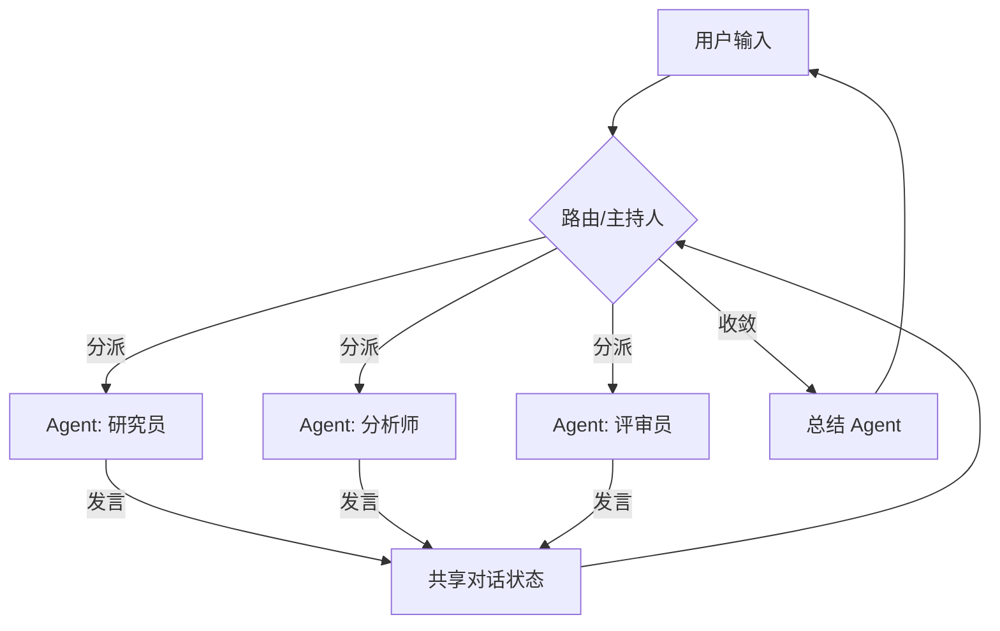

# Multi-Agent 对话模式

## 核心思想

多个专业化角色 Agent 通过**自由对话**协作完成任务。每个 Agent 有独立的系统提示和工具集，
通过路由机制决定下一个发言者。适合需要多视角分析、辩论、协商的场景。

## 参考架构



## 路由策略

| 策略 | 描述 | 适用场景 |
|------|------|---------|
| Round-Robin | 按固定顺序轮流发言 | 流水线式协作 |
| LLM-Routed | 由 LLM 判断下一个发言者 | 开放式讨论 |
| Function-Routed | 基于规则/关键词路由 | 确定性分发 |
| Broadcast | 所有 Agent 同时接收并响应 | 投票/并行分析 |
| Hierarchical | 上级 Agent 分派给下级 | 管理层级式协作 |

## 对话协议

```
conversation = ConversationState()

while not conversation.is_resolved:
    next_speaker = router.select(conversation)
    
    message = next_speaker.respond(
        conversation.history,
        conversation.shared_context
    )
    
    conversation.add_message(next_speaker.role, message)
    
    if convergence_check(conversation):
        summary = summarizer.summarize(conversation)
        break
```

## 组件职责

| 组件 | 职责 | 关键配置 |
|------|------|---------|
| Router / Moderator | 选择下一发言者、判断收敛 | `strategy`, `max_rounds` |
| Specialist Agent | 从特定视角响应 | `role`, `system_prompt`, `tools` |
| Shared State | 维护对话历史和共享数据 | `max_history`, `summary_interval` |
| Summarizer | 汇总讨论结果 | `format`, `key_points` |

## 适用场景

- 多角度分析和评审（安全评审 + 性能评审 + 架构评审）
- 辩论式决策（正方、反方、裁判）
- 专家会诊（多专科医生会诊）
- 创意头脑风暴（发散 → 收敛）

## 角色定义模板

```yaml
agent:
  id: "researcher"
  name: "研究员"
  role: "负责搜索和收集相关信息"
  system_prompt: |
    你是一位严谨的研究员。
    你的职责是搜索和整理与当前讨论相关的事实信息。
    总是引用信息来源。不要推测或编造数据。
  tools:
    - web_search
    - document_retrieval
  speak_when: "需要事实依据、数据支撑、或其他 Agent 引用了未验证信息时"
```

## 设计要点

1. **角色差异化**：每个 Agent 必须有明确不同的视角和能力
2. **收敛机制**：必须定义何时停止讨论（轮数上限、共识检测、质量门槛）
3. **共享状态**：决定哪些信息全局可见，哪些仅对特定 Agent 可见
4. **发言秩序**：避免"同质化"——如果所有 Agent 说同样的话，减少 Agent 数量
5. **冲突解决**：当 Agent 观点矛盾时，如何仲裁

## 常见陷阱

| 陷阱 | 表现 | 解决方案 |
|------|------|---------|
| 角色同质化 | 所有 Agent 给出相似回答 | 强化角色差异，限制信息共享 |
| 无限讨论 | 对话无法收敛 | 设置 max_rounds + 收敛检测 |
| Context 爆炸 | 对话太长超出窗口 | 定期摘要 + 滑动窗口 |
| 羊群效应 | 后发言者跟随先发言者 | 独立思考后再交流，或并行生成 |
