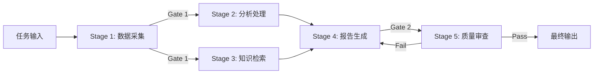

# Multi-Agent 工作流模式

## 核心思想

将复杂任务拆解为**有向无环图（DAG）**中的阶段，每个阶段由专门的 Agent 负责，
通过显式的输入/输出契约和质量门禁串联。适合流程确定、需要阶段质量保证的场景。

## 参考架构



## 工作流定义

```yaml
workflow:
  name: "research-report-pipeline"
  stages:
    - id: "collect"
      agent: "data-collector"
      inputs: ["user_query"]
      outputs: ["raw_data"]
      timeout: 60s
      
    - id: "analyze"
      agent: "analyst"
      inputs: ["raw_data"]
      outputs: ["analysis_result"]
      depends_on: ["collect"]
      
    - id: "retrieve"
      agent: "knowledge-retriever"
      inputs: ["user_query"]
      outputs: ["relevant_docs"]
      depends_on: ["collect"]
      parallel_with: ["analyze"]
      
    - id: "generate"
      agent: "report-writer"
      inputs: ["analysis_result", "relevant_docs"]
      outputs: ["draft_report"]
      depends_on: ["analyze", "retrieve"]
      
    - id: "review"
      agent: "quality-reviewer"
      inputs: ["draft_report"]
      outputs: ["final_report"]
      depends_on: ["generate"]
      gate:
        condition: "score >= 0.8"
        on_fail: "retry:generate"
        max_retries: 2
```

## 组件职责

| 组件 | 职责 | 关键配置 |
|------|------|---------|
| Workflow Engine | DAG 调度、状态跟踪 | `max_retries`, `timeout` |
| Stage Agent | 执行单一阶段任务 | `inputs`, `outputs`, `tools` |
| Quality Gate | 阶段间验证 | `condition`, `on_fail` |
| State Store | 中间产物持久化 | `backend`, `ttl` |

## 调度策略

| 策略 | 描述 | 实现方式 |
|------|------|---------|
| Sequential | 严格顺序执行 | `depends_on` 链式依赖 |
| Parallel | 无依赖阶段并行 | `parallel_with` 或自动检测 |
| Conditional | 根据条件分支 | `gate.condition` + `on_fail` |
| Fan-out / Fan-in | 一对多分发 + 汇聚 | 多阶段同一 `depends_on` |
| Iterative | 循环直到条件满足 | `gate.on_fail: retry` |

## 适用场景

- 数据处理流水线（采集 → 清洗 → 分析 → 可视化）
- 内容生产流水线（研究 → 撰写 → 审核 → 发布）
- 软件发布流水线（编码 → 测试 → 审查 → 部署）
- 多步骤任务自动化（表单提交 → 验证 → 处理 → 通知）

## 设计要点

1. **阶段粒度**：一个阶段 = 一个清晰的输入/输出变换，不要太粗也不要太细
2. **契约优先**：先定义每个阶段的输入/输出 schema，再实现
3. **幂等性**：每个阶段应支持重试而不产生副作用
4. **超时控制**：每个阶段和整体工作流都设置超时
5. **可观测性**：记录每个阶段的输入、输出、耗时、token 消耗

## 质量门禁模板

```yaml
gate:
  name: "report-quality-gate"
  checks:
    - type: "completeness"
      condition: "all required sections present"
    - type: "accuracy"
      condition: "no factual contradictions"
    - type: "format"
      condition: "follows output schema"
  on_pass: "continue"
  on_fail:
    action: "retry_previous"
    max_retries: 2
    feedback: "将检查失败原因反馈给上游 Agent"
```

## 常见陷阱

| 陷阱 | 表现 | 解决方案 |
|------|------|---------|
| 阶段耦合 | 修改一个阶段影响其他阶段 | 严格的输入/输出 schema |
| 重试风暴 | 质量门禁反复失败 | 设置 max_retries + 降级策略 |
| 状态丢失 | 中间产物未持久化 | 每个阶段输出写入 state store |
| 并行竞争 | 并行阶段写同一资源 | 输出隔离，在汇聚点合并 |
