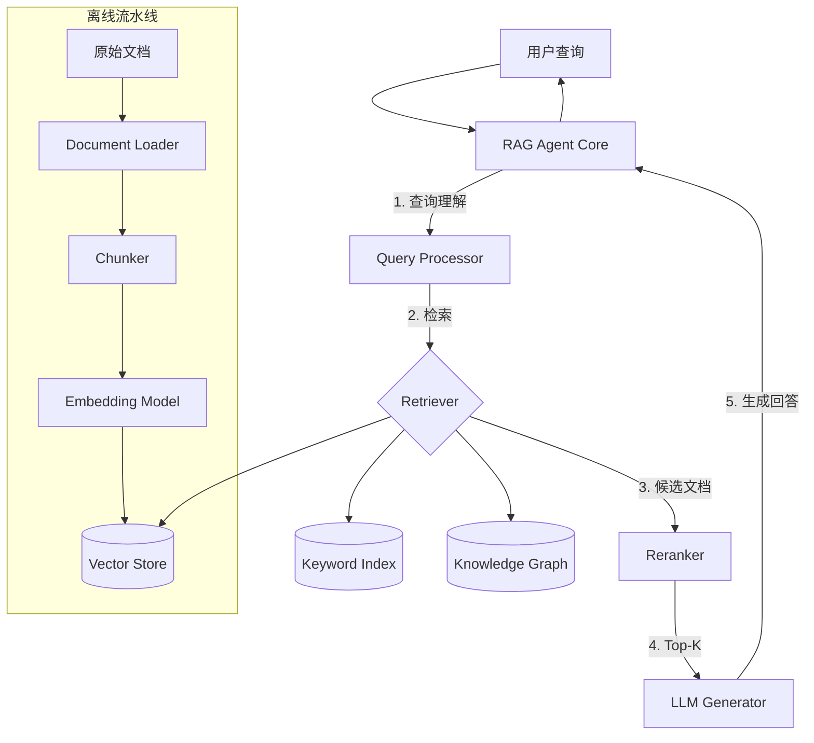

# RAG Agent 架构模式

## 核心思想

**Retrieval-Augmented Generation** — 将外部知识库的检索能力与 LLM 生成能力结合，
Agent 在回答前先从知识库中检索相关文档片段，以此作为上下文增强生成质量。

## 参考架构



## 离线流水线

### 1. 文档加载

| 数据源 | Loader 类型 | 注意事项 |
|--------|-----------|---------|
| PDF | PDF Parser | 表格和图片需特殊处理 |
| Markdown | Text Splitter | 按标题层级拆分 |
| HTML | HTML Parser | 去除导航和样板文本 |
| 数据库 | SQL Loader | 定期增量同步 |
| API | API Fetcher | 考虑速率限制和缓存 |

### 2. 分块策略

| 策略 | 片段大小 | 适用场景 |
|------|---------|---------|
| Fixed Size | 512-1024 tokens | 通用文本 |
| Recursive | 按文档结构 | 带层级的文档 |
| Semantic | 按语义边界 | 长文章、论文 |
| Sentence | 按句子分割 | 对话、FAQ |
| Parent-Child | 大块+小块 | 保留上下文 + 精确检索 |

### 3. Embedding 模型选择

| 模型 | 维度 | 适用语言 | 备注 |
|------|------|---------|------|
| text-embedding-3-small | 1536 | 多语言 | OpenAI，性价比高 |
| text-embedding-3-large | 3072 | 多语言 | OpenAI，高精度 |
| bge-m3 | 1024 | 中英文 | 开源，支持混合检索 |
| nomic-embed-text | 768 | 英文 | 开源，本地部署 |

### 4. 向量数据库

| 数据库 | 部署方式 | 适用规模 | 混合检索 |
|--------|---------|---------|---------|
| Chroma | 嵌入式/独立 | 小-中 | ❌ |
| Qdrant | Docker/Cloud | 中-大 | ✅ |
| Milvus | Docker/Cloud | 大 | ✅ |
| Weaviate | Docker/Cloud | 中-大 | ✅ |
| pgvector | PostgreSQL 扩展 | 小-中 | ❌ |
| FAISS | 嵌入式 | 中 | ❌ |

## 在线检索

### 查询理解

```
1. 意图分类 → 需要检索 / 直接回答 / 多步推理
2. 查询重写 → 扩展关键词、分解子问题
3. HyDE（可选）→ 先生成假设性答案，用假设答案做检索
```

### 检索策略

| 策略 | 描述 | 适用场景 |
|------|------|---------|
| Dense | 纯向量相似度检索 | 语义匹配 |
| Sparse | 关键词匹配（BM25） | 精确术语查找 |
| Hybrid | Dense + Sparse 融合 | 生产推荐 |
| Multi-Query | 生成多个查询变体 | 模糊问题 |
| Self-Query | 从查询中提取过滤条件 | 结构化 + 非结构化 |

### Reranking

```
candidates = retriever.search(query, top_k=20)
reranked = reranker.rerank(query, candidates, top_k=5)
context = format_context(reranked)
answer = llm.generate(query, context)
```

## 组件职责

| 组件 | 职责 | 关键配置 |
|------|------|---------|
| Document Loader | 加载和预处理文档 | `source_type`, `encoding` |
| Chunker | 文档分块 | `chunk_size`, `overlap`, `strategy` |
| Embedding Model | 文本向量化 | `model`, `dimension` |
| Vector Store | 存储和检索向量 | `backend`, `index_type` |
| Reranker | 候选文档重排序 | `model`, `top_k` |
| Generator | 基于上下文生成回答 | `model`, `max_tokens` |

## 设计要点

1. **分块大小**：太小丢失上下文，太大引入噪声，通常 512-1024 token
2. **Overlap**：相邻片段重叠 10-20%，避免信息在分割处丢失
3. **Metadata**：每个片段保留来源、页码、时间戳，用于引用和过滤
4. **Reranking**：比单纯增大 top_k 更有效
5. **Hallucination Guard**：提示 LLM"仅基于提供的上下文回答，不确定时说不知道"

## 常见陷阱

| 陷阱 | 表现 | 解决方案 |
|------|------|---------|
| 检索不相关 | 返回的文档与问题无关 | 优化 embedding 模型 + 混合检索 |
| 上下文不足 | 答案不完整 | 增大 top_k 或使用 parent-child 策略 |
| 信息过时 | 知识库未更新 | 增量同步 + 时间衰减权重 |
| 幻觉回答 | 生成了知识库中没有的内容 | Grounding 检查 + 引用要求 |
