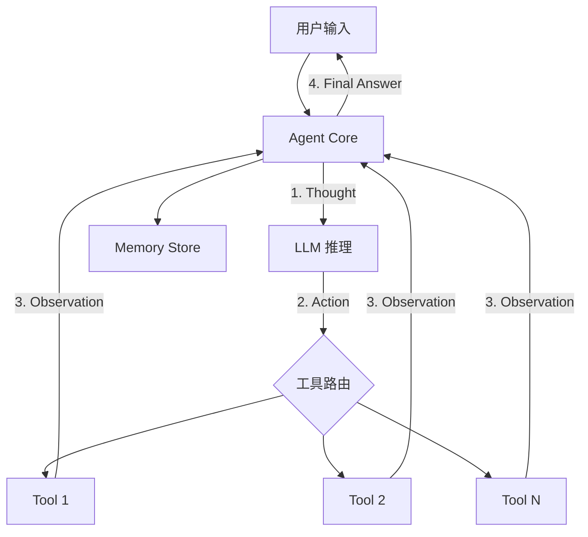

# ReAct Agent 架构模式

## 核心思想

**Reasoning + Acting** — Agent 在每一步中先推理（Thought），然后决定行动（Action），
再根据行动结果观察（Observation），循环执行直到得出最终答案。

## 参考架构



## 执行循环

```
while not done and iterations < max_iterations:
    thought = llm.think(prompt + history + observations)
    
    if thought.is_final_answer:
        return thought.answer
    
    action = thought.selected_tool
    observation = tools.execute(action.name, action.params)
    history.append(thought, action, observation)

return "达到最大迭代次数，当前最佳结果: ..."
```

## 组件职责

| 组件 | 职责 | 关键配置 |
|------|------|---------|
| Agent Core | 主控循环、维护状态 | `max_iterations`, `timeout` |
| LLM Client | 推理、决策 | `model`, `temperature`, `max_tokens` |
| Tool Registry | 注册工具、分发调用 | 工具列表、参数验证 |
| Memory | 存储对话历史 | `type`, `window_size` |

## 适用场景

- 需要多步推理的通用任务（搜索 → 分析 → 汇总）
- 信息收集和整合
- 问答 + 操作（查询数据 → 执行修改）
- 客户支持（诊断问题 → 查找解决方案 → 执行操作）

## 设计要点

1. **Prompt 设计**：必须清晰描述可用工具、何时使用、输出格式
2. **终止条件**：明确定义什么是最终答案
3. **迭代上限**：防止无限循环，建议 5-15 次
4. **工具描述**：精确的工具描述是 ReAct 成功的关键
5. **错误恢复**：工具失败时 Agent 应能尝试替代方案

## 常见陷阱

| 陷阱 | 表现 | 解决方案 |
|------|------|---------|
| 工具描述模糊 | Agent 选错工具或传错参数 | 精确的 description + few-shot |
| 无限循环 | 反复调用相同工具 | 设置 max_iterations + 去重检测 |
| 过度推理 | 不必要地调用工具 | 在 prompt 中明确"能直接回答则直接回答" |
| 错误传播 | 一个工具失败导致后续全错 | 每步观察后评估是否继续 |
