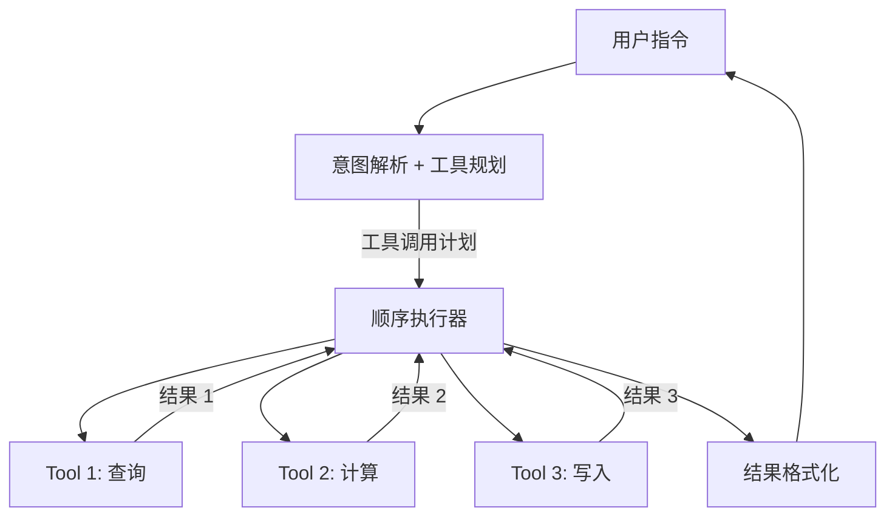

# Tool-Use Chain 模式

## 核心思想

Agent 以**工具调用链**为核心能力——接收任务后，按顺序或条件选择并调用一系列外部工具，
将工具返回结果作为下一步输入，最终组合所有结果完成复杂操作。

与 ReAct 的区别：Tool-Use Chain 更侧重**确定性工具编排**而非开放式推理循环，
工具调用流程通常更短、更精确。

## 参考架构



## 工具定义规范

```yaml
tool:
  name: "search_orders"
  description: "按订单号或客户名搜索订单列表。返回匹配的订单摘要数组。"
  parameters:
    type: object
    properties:
      query:
        type: string
        description: "搜索关键词：订单号或客户名"
      status:
        type: string
        enum: ["pending", "shipped", "delivered", "cancelled"]
        description: "可选：按状态过滤"
      limit:
        type: integer
        default: 10
        description: "返回结果数量上限"
    required: ["query"]
  returns:
    type: array
    items:
      type: object
      properties:
        order_id: { type: string }
        customer: { type: string }
        status: { type: string }
        total: { type: number }
  errors:
    - code: "NOT_FOUND"
      description: "未找到匹配订单"
    - code: "RATE_LIMITED"
      description: "请求过于频繁"
```

## 工具选择策略

| 策略 | 描述 | 适用场景 |
|------|------|---------|
| LLM Native | 利用 LLM function calling | 工具数 < 20 |
| Intent + Routing | 先分类意图再路由到工具子集 | 工具数 > 20 |
| Embedding Match | 用工具描述向量匹配 | 大量工具（100+） |
| Static Flow | 预定义工具调用顺序 | 确定性流程 |

## 链式执行模式

```
# 模式 1: 顺序链
result1 = tool_a(user_input)
result2 = tool_b(result1)
final = tool_c(result2)

# 模式 2: 并行 + 汇聚
results = parallel([
    tool_a(user_input),
    tool_b(user_input),
])
final = tool_c(merge(results))

# 模式 3: 条件分支
result1 = tool_a(user_input)
if result1.needs_approval:
    result2 = tool_approve(result1)
else:
    result2 = tool_auto_process(result1)
```

## 组件职责

| 组件 | 职责 | 关键配置 |
|------|------|---------|
| Intent Parser | 解析用户意图和参数 | `model`, `few_shot_examples` |
| Tool Registry | 管理工具元数据和实现 | `tools`, `validation` |
| Executor | 按计划调用工具 | `timeout`, `retry`, `parallel` |
| Result Formatter | 整合工具结果为用户可读输出 | `format`, `template` |

## 适用场景

- API 编排（查询 → 修改 → 通知）
- 数据 ETL（提取 → 转换 → 加载）
- 业务流程自动化（创建订单 → 检查库存 → 扣款 → 发货）
- 系统运维（检查状态 → 诊断问题 → 执行修复）

## 设计要点

1. **工具描述质量**：description 是 LLM 选择工具的唯一依据，必须精确
2. **参数验证**：在调用前验证参数类型和范围
3. **错误处理**：每个工具定义可能的错误码和恢复策略
4. **幂等设计**：写操作工具应支持幂等调用
5. **权限控制**：敏感操作（删除、付款）需要确认步骤

## 工具包装最佳实践

```
原则:
  1. 一个工具做一件事
  2. 工具名用动词 + 名词（search_orders, create_ticket）
  3. 参数用 snake_case，必须有 description
  4. 返回结构化数据（不要返回纯文本长篇）
  5. 错误返回要区分可重试和不可重试
  6. 敏感操作加 confirmation 参数
```

## 常见陷阱

| 陷阱 | 表现 | 解决方案 |
|------|------|---------|
| 工具过多 | LLM 选择困难、延迟高 | 按意图分组，分层路由 |
| 参数幻觉 | LLM 编造不存在的参数值 | 强 schema 验证 + enum 约束 |
| 写操作无确认 | 误操作无法挽回 | 敏感操作返回预览 + 确认 |
| 错误吞没 | 工具失败但 Agent 继续 | 显式错误检查 + 回退路径 |
