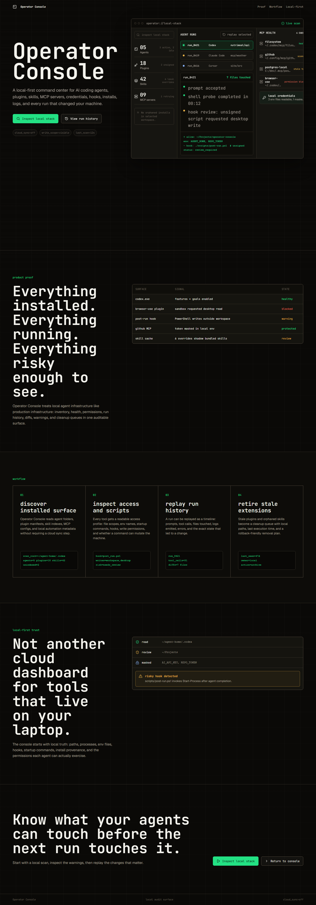
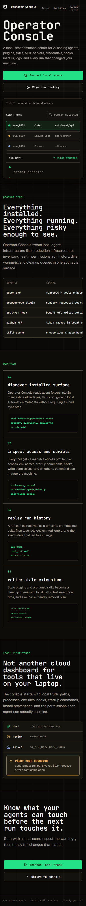
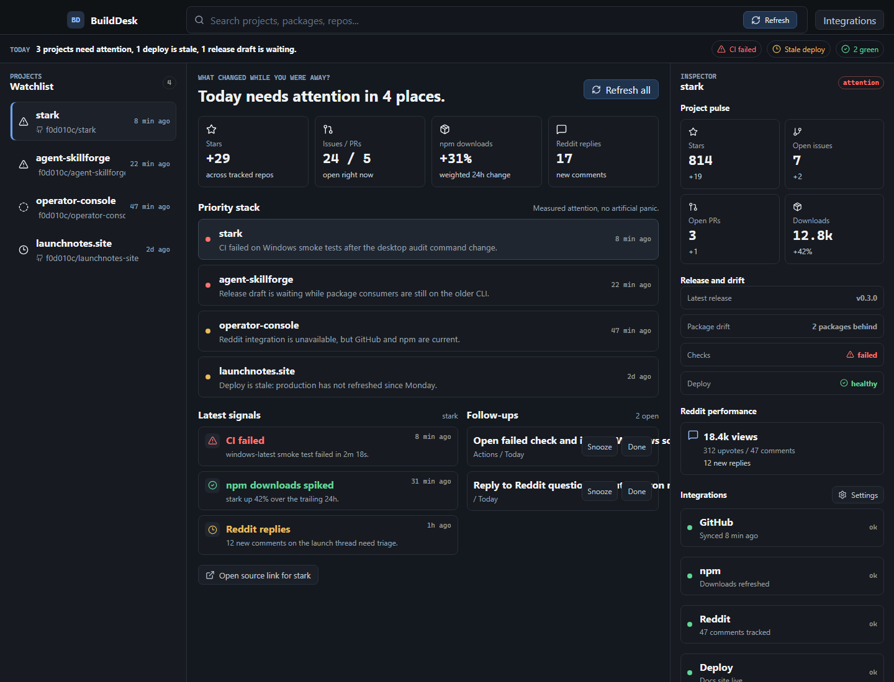
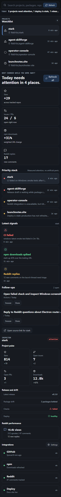
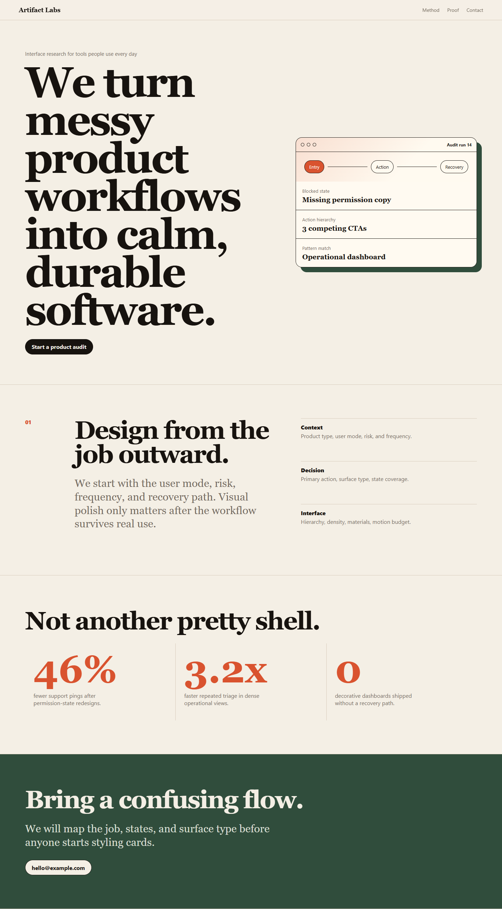
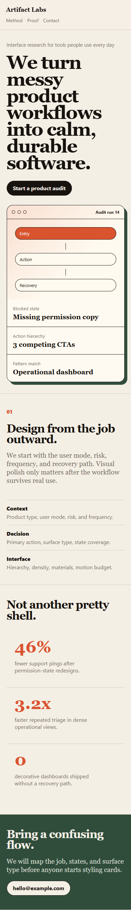
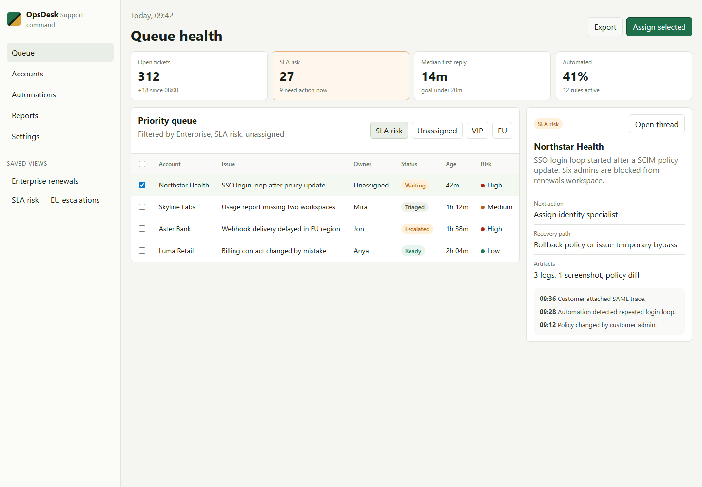
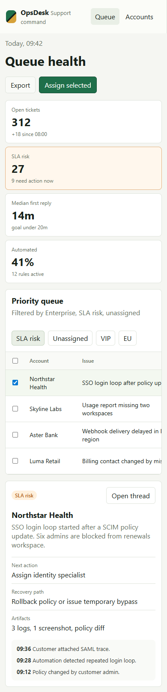
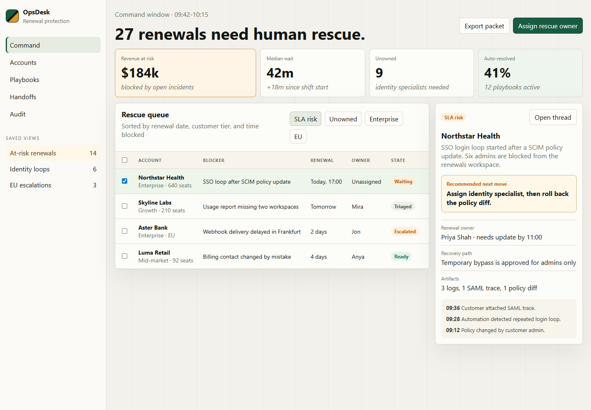
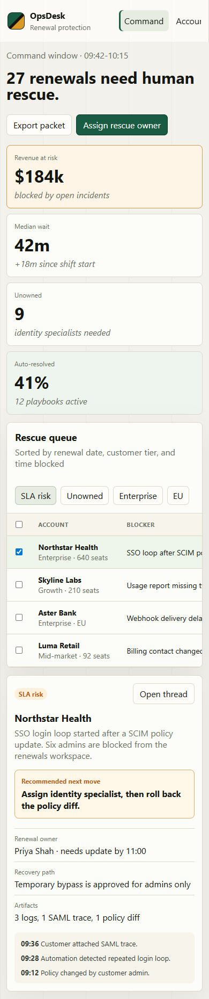

# stark

[](https://github.com/f0d010c/stark/releases)
[](LICENSE)
[](README.md)
[](README.md)

Anti-slop UI/UX design plugin for AI coding agents.
It routes UI and UX requests to focused skills, asks the right product-flow / platform / track / direction questions first, then helps agents ship usable interfaces instead of template clones.

This repo ships both Claude Code and Codex plugin manifests so the same Stark skillset can work across more than one agent environment.

## Why this exists

AI design output often defaults to the same web-shaped answer: React, Tailwind, shadcn, Inter, purple gradients, centered hero, three cards, CTA strip.
That is wrong for native apps, and it is boring on the web.

`stark` pushes Codex toward the right product and design idiom before code:

- UX maps product flows, states, IA, forms, onboarding, dashboards, and repeated-use ergonomics before pixels.
- UX produces a compact decision brief that platform skills must preserve during implementation.
- Contextual UX briefs cover agent runs, operational dashboards, activation onboarding, checkout/upgrade, and editor/canvas tools.
- UI produces a visual decision brief for surface type, hierarchy, density, component grammar, motion budget, and state visuals.
- Asset planning chooses icons, screenshots, references, typography, generated UI mocks, and optional GPT/Codex image generation before implementation.
- Reference analysis extracts structure from shipped products, Mobbin/Figma screens, docs, and screenshots without copying visual identity.
- Web asks for an aesthetic direction first.
- Windows asks whether the app should be system-like WinUI, branded WinUI, Tauri, or Electron.
- Apple asks whether the app should be strict SwiftUI, branded SwiftUI, React Native, Flutter, or desktop web shell.
- Android asks whether the app should be Compose, branded Compose, React Native, Flutter, or Compose Multiplatform.
- Cross-platform work gets explicit fidelity warnings.
- Token work uses W3C DTCG design tokens and export scripts.

## Install In Codex

Use this repository as a Codex plugin source.
The Codex manifest lives at:

```text
.codex-plugin/plugin.json
```

For local testing, point Codex at this folder or install it through the Codex plugin flow once it is pushed to a GitHub repository.
After installation, restart or reload Codex so the skills are indexed.

## Use

Use natural language.
Codex should trigger the matching skill automatically:

```text
Design a landing page for a type foundry that does not look like generic SaaS.
Make a Win11 app shell with NavigationView and Mica.
Build an iOS 26 settings screen with Liquid Glass.
Create a Compose Material 3 Expressive workout screen.
Improve the onboarding UX for this app so users reach first value faster.
Design the empty, loading, error, and success states for this dashboard.
Translate this iOS settings screen into a Windows app.
Audit this React hero section for UX problems and AI design slop.
Export these DTCG tokens to Tailwind and SwiftUI.
```

If the target is ambiguous, `design-router` asks which platform to use instead of defaulting to web.

## Slash Command Mapping

The Claude version included slash commands.
Codex uses skills and natural-language routing instead.

| Claude command | Codex equivalent |
|---|---|
| `/stark ux <brief>` | `Use stark ux-design for <brief>` or ask for UX / product flow help |
| `/stark web <brief>` | `Use stark web-design for <brief>` or simply ask for a web UI |
| `/stark windows <brief>` | Ask for a Windows / WinUI / Fluent UI |
| `/stark apple <brief>` | Ask for an iOS / macOS / SwiftUI UI |
| `/stark android <brief>` | Ask for an Android / Compose UI |
| `/stark auto <brief>` | Ask normally; `design-router` decides or asks one question |
| `/stark-audit <file>` | `Audit <file> with stark for UX problems and AI design slop` |
| `/stark-assets <brief>` | `Use stark assets to plan the visual assets before building` |
| `/stark-reference <brief>` | `Use stark reference analysis before designing from shipped examples` |
| `/stark-translate apple windows <file>` | `Translate this Apple UI to Windows using stark` |

## What's Inside

```text
stark/
  .codex-plugin/plugin.json      Codex plugin manifest
  .claude-plugin/                Claude Code manifest kept for compatibility
  skills/
    design-router/               UX and platform dispatcher
    ux-design/                   flows, states, IA, forms, onboarding, dashboards
  references/ui-patterns/         surface taxonomy, visual hierarchy, responsive containment, asset selection, reference analysis, motion budget, UI audit rubric
  references/ux-patterns/         contextual product-flow briefs
    web-design/                  6 web aesthetic directions
    windows-design/              WinUI / branded WinUI / Tauri / Electron
    apple-design/                SwiftUI / RN / Flutter / desktop shells
    android-design/              Compose / RN / Flutter / CMP
    cross-platform-design/       idiom translation and fidelity warnings
    design-tokens/               DTCG token generation and export
  references/                    design philosophy, platform docs, web patterns
  assets/                        token bundles, font pairs, screenshot gallery
  scripts/                       platform detection and token export helpers
  commands/                      legacy Claude slash-command docs
  evals/                         trigger evaluation prompts
```

## Web Directions

`web-design` asks for one direction before generating code:

1. Editorial Swiss revival
2. Tactile brutalism
3. Type-as-hero
4. Glow + grain
5. Industrial monospace
6. Active bento

Each direction has its own typography, palette, layout grammar, motion language, copy voice, reference apps, and ban list.

## Screenshot Gallery

The repo keeps proof as screenshots instead of full generated app folders, so the plugin stays small and installable.

| Project | Desktop | Mobile |
|---|---|---|
| Operator Console |  |  |
| BuildDesk |  |  |
| Artifact Labs |  |  |
| Ops Dashboard |  |  |
| CRM v2 |  |  |

Screenshot folders live under `assets/screenshots/<project>/`.

## Native Tracks

`stark` does not silently turn every app into a website.

- Windows: system-like WinUI 3, branded WinUI 3, Tauri 2, Electron
- Apple: strict SwiftUI, branded SwiftUI, React Native, Flutter, Tauri / Electron for macOS
- Android: Compose strict, branded Compose, React Native, Flutter, Compose Multiplatform
- Cross-platform: Tauri, React Native, Flutter, Compose Multiplatform, Uno, Avalonia, MAUI with explicit tradeoffs

## Helper Scripts

```bash
python scripts/detect_platform.py --text "Build a Settings screen for Win11 with Mica"
python scripts/token_export.py --input assets/tokens/fluent-2.json --target winui --output Resources.xaml
```

## Test

Run SkillForge against the plugin:

```bash
npx agent-skillforge lint . --format text
npx agent-skillforge smoke .
```

Manual smoke prompts:

```text
Design a developer-tool landing page in the industrial monospace direction.
Improve the trial onboarding UX for a B2B analytics dashboard.
Audit src/components/Hero.tsx for UX and web anti-slop issues.
Translate this Apple settings screen to Windows using stark.
```

## Compatibility

This repo is intentionally dual-shaped:

- Codex reads `.codex-plugin/plugin.json` and `skills/*/SKILL.md`.
- Claude Code can still use `.claude-plugin/` and `commands/`.

The skill content is shared so fixes improve both surfaces.

## License

Apache 2.0. See `LICENSE` and `NOTICE`.
